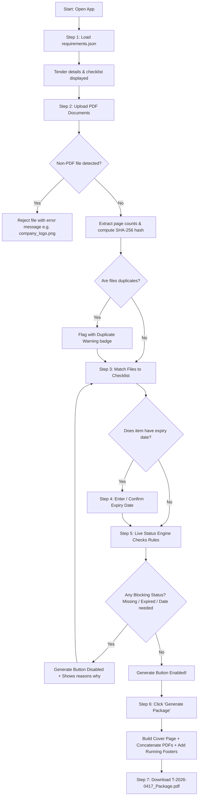

# Tender Document Package Builder — Project Flow & User Journey

This document explains **how the web app works** in simple, plain English. It guides you step-by-step through what a user sees, clicks, and experiences from the moment they open the website until they download their final, verified tender package.

---

## 🎯 The Big Picture (What is this app for?)

Imagine you work at a company submitting a bid for a big government contract. The government gives you a list of rules:
> *"You must include your Trade License first, then your TIN Certificate, your Bank Solvency letter, and your technical proposal. If any document is expired, duplicate, or in the wrong order, your bid is immediately rejected!"*

Normally, office staff have to print, check dates, and organize these papers by hand. It is stressful and full of human errors.

**This web application automates the entire process inside the web browser.** It acts as an intelligent assistant that checks every document, catches mistakes before they happen, and generates a single, beautifully bound master PDF with a cover page and running page numbers.

---

## 🗺️ Complete End-to-End Workflow Diagram

---

## 🚶 Step-by-Step User Journey (Plain English)

### Step 1: Open App & Load the Tender Rules
* **What the user does**:
  1. The user opens the web app in Google Chrome.
  2. They drop their `requirements.json` file into the upload box (or click **"Load Sample Tender"** for instant testing).
* **What happens**:
  - The app immediately shows the **Tender Information Banner**:
    - **Tender ID**: `T-2026-0417`
    - **Tender Name**: Supply of IT Equipment
    - **Procuring Entity**: Directorate of Sample Services
    - **Bidder**: Meghna Tech Solutions Ltd.
    - **Deadline**: `2026-10-20` (October 20, 2026)
  - Below this, an organized checklist appears with all 10 required documents sorted in order (Order 1 to 10).
  - Each item shows whether it is **Mandatory** (Required) or **Optional**.
  - All mandatory items start with a red **Missing** badge because no files are matched yet.

---

### Step 2: Upload Document Files
* **What the user does**:
  1. The user drags a folder or multiple PDF files into the **File Upload Area**.
* **What the app checks**:
  - **Is it a PDF?**: If someone accidentally includes an image like `company_logo.png`, the app stops it:
    > ⚠️ *"company_logo.png is not a PDF file. Please upload PDF files only."*
  - **Page Counting**: The app opens each PDF in memory and counts how many pages it has (e.g., `02_technical_proposal.pdf: 6 pages`).
  - **Duplicate Detection**: The app creates a digital fingerprint (hash) of every file. If two files have the exact same content (like `experience_cert.pdf` and `experience_cert (1).pdf`), the app highlights them:
    > ⚠️ *"Duplicate content detected with experience_cert.pdf"*. The app will not allow the user to assign duplicate copies to two different checklist items.

---

### Step 3: Match Files to the Checklist
* **What the user does**:
  1. The user connects each uploaded file to the matching requirement.
  2. They can click **"Auto-Match"** to let the app intelligently guess the right file based on filename, or choose from a clean dropdown.
* **The 1-to-1 Rule**:
  - One document checklist slot gets at most **one** file.
  - One file can belong to at most **one** checklist slot.
  - If the user changes their mind, they can click **"Unmatch"** anytime to free up the file.

---

### Step 4: Handle Expiry Dates
* **What happens**:
  - Some documents (like Trade License and Bank Solvency) have expiration dates (`has_expiry = true`).
  - As soon as a file is matched to one of these documents, a date picker appears.
  - The user enters the expiration date shown on their certificate (or the app auto-fills it if detected in the document text).
* **Expiry Validation**:
  - The app compares the expiry date against the Tender Submission Deadline (`2026-10-20`):
    - **Trade License 2025** (Expires June 30, 2025): **EXPIRED!** (Before the deadline). Status turns red: 🔴 **Expired**.
    - **Trade License 2026** (Expires June 30, 2027): **VALID!** Status turns green: 🟢 **OK**.
    - **Bank Solvency** (Expires December 31, 2026): **VALID!** Status turns green: 🟢 **OK**.

---

### Step 5: Real-Time Traffic Light Status
At every second, every requirement displays **exactly one** clear status badge:

| Status Badge | Meaning | Does it block package creation? |
| :---: | :--- | :---: |
| 🔴 **Missing** | Required document, but no file is matched yet. | **YES (Blocks)** |
| 🟡 **Expiry date needed** | Matched to a file, but user hasn't entered the expiry date. | **YES (Blocks)** |
| 🔴 **Expired** | Expiry date is before the tender deadline. | **YES (Blocks)** |
| ⚪ **Not provided** | Optional document (e.g. Audited Financials) with no file. | **NO (Allowed)** |
| 🟢 **OK** | File matched, and valid on or after the deadline. | **NO (Allowed)** |

* **The Safety Lock**: The **"Generate Package"** button stays disabled as long as any document has a blocking status. Right next to the button, the app clearly explains:
  > *"Cannot generate yet: 1 document is Missing, 1 document is Expired."*

---

### Step 6: Generate the Master Package
* When all required documents are green (or optional items are "Not provided"), the **"Generate Package"** button lights up!
* When the user clicks **"Generate Package"**:
  1. **Page 1: Formal Cover Page**:
     - Automatically crafted in English.
     - Includes Tender ID, Title, Procuring Entity, Bidder, Deadline, Creation Date.
     - Lists every included document in exact order with its page count.
  2. **Page 2: Table of Contents / Index (Bonus)**:
     - Shows where each document begins (e.g., Trade License: Page 3, Technical Proposal: Page 9).
  3. **The Document Pages**:
     - All pages from the matched PDFs are merged in strict numerical order (`order: 1` through `10`).
     - Optional documents with no file are skipped cleanly.
  4. **Running Page Numbers**:
     - Every single page (including the cover) receives a crisp bottom footer:
       `T-2026-0417 | Page X of Y` (e.g., `Page 1 of 16`).

---

### Step 7: Download & Submit
* The user clicks **Download**.
* The file is automatically saved to their computer as:
  **`T-2026-0417_Package.pdf`**
* The user can also:
  - **Export Checklist**: Download an Excel/CSV spreadsheet report of all verified documents and expiry dates.
  - **Save Project**: Save their progress to browser storage or export a `.json` project backup to continue later.
  - **Switch Languages**: Toggle between English and **বাংলা (Bangla)** at any point without losing any data.

---

## 🛡️ How Real-Life Traps Are Solved by This Flow

1. **Non-PDF Trap (`company_logo.png`)**:
   - The file is rejected at upload with a clear alert. It never pollutes the checklist.
2. **Duplicate Files Trap (`experience_cert.pdf` & `experience_cert (1).pdf`)**:
   - Both have identical content. The app flags the duplicate and prevents double-matching.
3. **Expired License Trap (`trade_license_2025.pdf`)**:
   - Marked as `Expired` because June 2025 is before October 2026. The app blocks submission until the user picks `trade_license_2026.pdf`.
4. **Scanned File Trap (`scan_0042.pdf`)**:
   - The app allows matching this scan to the **Signed Declaration (R10)** and displays its preview image so the user can verify the signature and seal.
5. **Ordering Trap (`01_financial_proposal.pdf` vs `02_technical_proposal.pdf`)**:
   - Despite file names starting with `01_` and `02_`, the app arranges Technical Proposal first (Order 8) and Financial Proposal second (Order 9) as specified by the tender rules.
