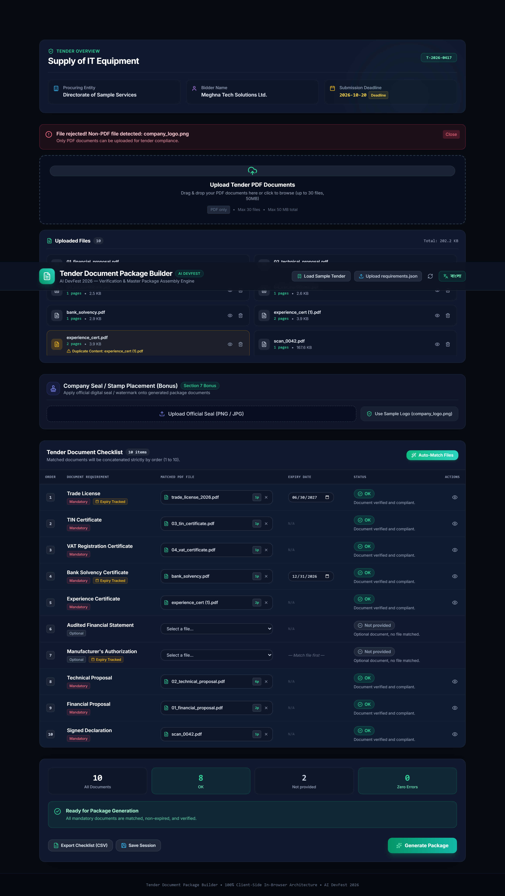
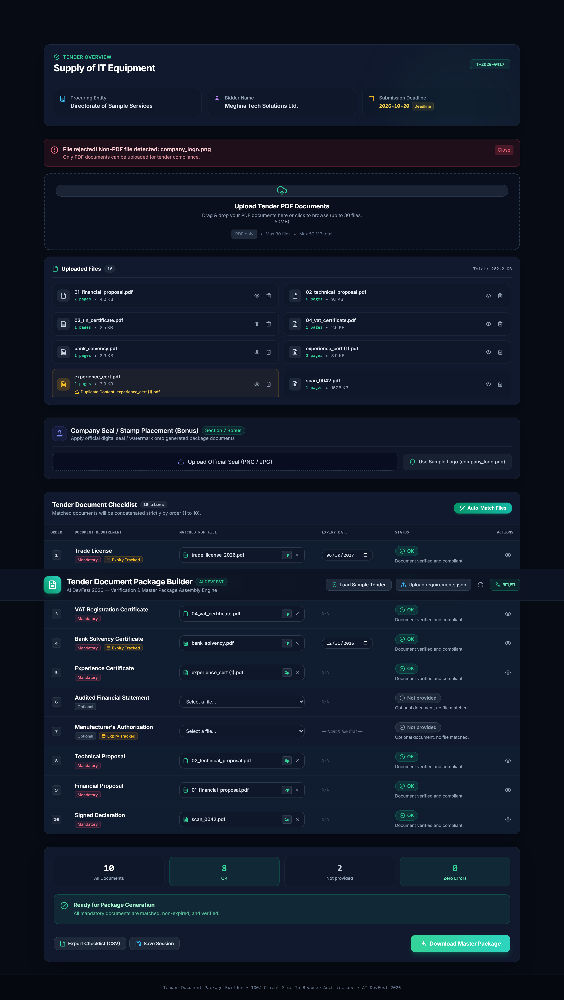
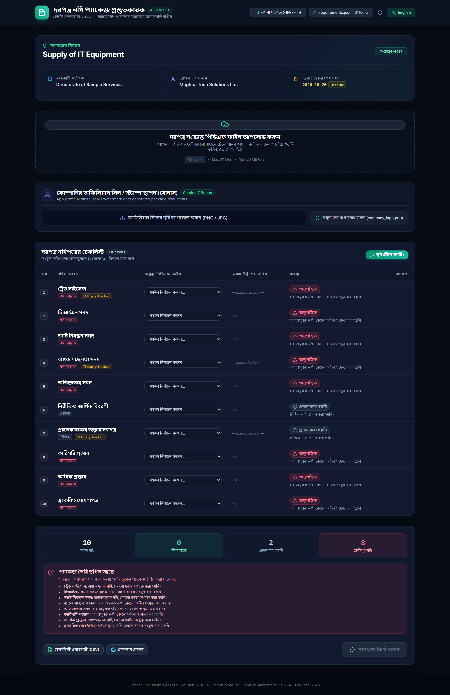
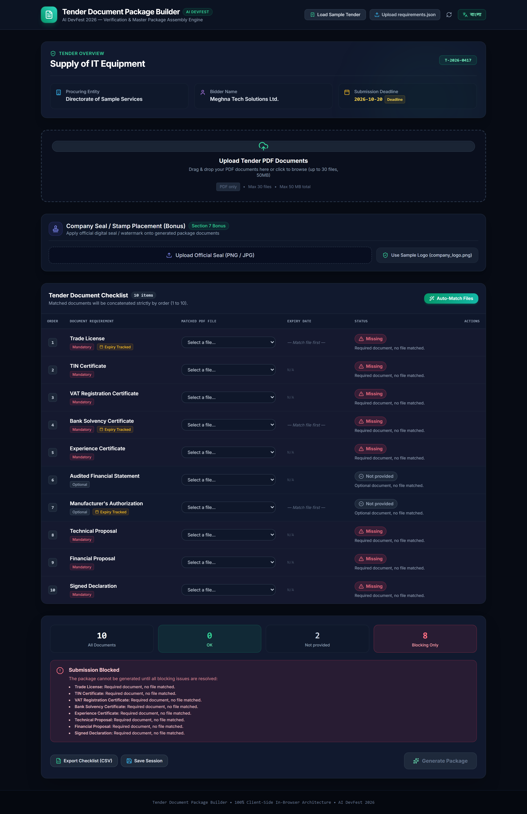

# 📋 Tender Document Package Builder

> **AI DevFest 2026 — Vibe Coding Track Submission**  
> A high-performance, 100% client-side web application for tender document compliance verification, deduplication, and automated master PDF package assembly.

[](https://reactjs.org/)
[](https://vitejs.dev/)
[](https://www.typescriptlang.org/)
[](https://tailwindcss.com/)
[](https://developer.mozilla.org/)

---

## 🎯 Executive Overview

In competitive government and institutional procurement (e.g., e-GP and offline public tenders), bids are frequently disqualified due to missing mandatory attachments, expired trade licenses, wrong document sequencing, or unformatted submittals.

The **Tender Document Package Builder** eliminates submission errors by performing instant in-browser validation against tender criteria and compiling a single, audit-ready master PDF package (`<tender_id>_Package.pdf`) with automated cover sheets, index table, and continuous running page footers.

### 🛡️ Privacy & Compliance Guarantee
- **100% Client-Side Processing**: Runs entirely inside Google Chrome via WebAssembly and browser APIs (`pdf-lib`, `pdfjs-dist`, Web Crypto API).
- **Zero Server Uploads**: No confidential financial proposals, trade licenses, or bank solvency certificates leave the bidder's computer.

---

## 🚀 Key Features

### 1. Multi-Document Verification Engine (Section 5)
Evaluates requirements against 5 distinct, deterministic states:
- 🔴 **Missing**: Required mandatory document with no matched file (**Blocks generation**).
- 🟡 **Expiry date needed**: Matched document requires an expiration check but no date was provided (**Blocks generation**).
- 🔴 **Expired**: Document expiry date is before the tender submission deadline (**Blocks generation**).
- ⚪ **Not provided**: Optional requirement with no file attached (**Non-blocking**).
- 🟢 **OK**: Valid file attached and compliant expiration date (**Non-blocking**).

### 2. Real-World Trap Handling
- **Non-PDF Rejection**: Explicit rejection banner when attempting to upload image files (e.g., `company_logo.png`) or non-PDF formats.
- **SHA-256 Duplicate Content Detection**: Uses `crypto.subtle.digest('SHA-256')` to identify identical binary files regardless of filename variations (e.g., `experience_cert.pdf` vs `experience_cert (1).pdf`). Prevents assigning duplicate content to multiple checklist slots.
- **Document Expiry Comparison**: Detects expired licenses (e.g., `trade_license_2025.pdf` expiring 2025-06-30 vs 2026-10-20 tender deadline) and blocks compilation until replaced with valid licenses (e.g., `trade_license_2026.pdf` expiring 2027-06-30).
- **Scanned Document Identification**: Matches unlabeled scans (e.g., `scan_0042.pdf`) to signed declaration requirements.
- **Strict Ordering Guarantee**: Assembles documents strictly by tender `order` (1–10), never by filename prefix (e.g., `01_financial_proposal.pdf` is placed at #9, after #8 `02_technical_proposal.pdf`).

### 3. Master PDF Package Assembly (Section 6)
- **Page 1 Cover Sheet**: Formatted in English with Tender ID, Title, Procuring Entity, Bidder Name, Submission Deadline, Generation Date, and a summary table of included documents.
- **Page 2 Table of Contents / Index**: Lists starting page numbers for every included document.
- **Ordered PDF Concatenation**: Merges all valid documents in ascending requirement order.
- **Running Page Footer**: Stamps `<tender_id> | Page X of Y` centered with a dividing rule on every page without obscuring document content.
- **Normalized Output**: Produces exact file naming `<tender_id>_Package.pdf` (e.g., `T-2026-0417_Package.pdf`).

### 4. High-End UI & Experience
- **Bilingual Interface**: Seamless toggle between English and Bangla (বাংলা) with native typography (`Hind Siliguri`).
- **Official Digital Seal / Stamp Placement (Section 7 Bonus)**: Upload or select company seal (`company_logo.png`), pick placement corner (Bottom-Right, Bottom-Left, Top-Right, Center), target pages, and opacity.
- **Live PDF Preview Modal**: In-browser inspection of any uploaded file before generation.
- **Session Persistence**: Auto-saves checklist assignments to `localStorage` and provides CSV export.

---

## 📸 Screenshots

| Screen | Description |
| :--- | :--- |
|  | **Verified Checklist & Seal Tool**: All documents matched and verified with non-PDF and duplicate indicators. |
|  | **Package Ready**: Master PDF assembled with download action and celebration. |
|  | **Bilingual Mode (বাংলা)**: Native Bengali localization and terminology. |
|  | **Initial State**: Clear visual indicators for blocking requirements. |

---

## 🛠️ Tech Stack & Architecture

- **Framework**: [React 18](https://react.dev/) + [Vite 6](https://vitejs.dev/)
- **Language**: [TypeScript 5.7](https://www.typescriptlang.org/)
- **Styling**: [Tailwind CSS 3.4](https://tailwindcss.com/)
- **PDF Manipulation**: [pdf-lib 1.17](https://pdf-lib.js.org/) (Client-side manipulation and generation)
- **PDF Parsing**: [pdfjs-dist 4.10](https://mozilla.github.io/pdf.js/) (Text extraction and inspection)
- **Hashing**: Web Crypto API (`SHA-256`)
- **Icons**: [Lucide React](https://lucide.dev/)
- **Animations**: [canvas-confetti](https://www.npmjs.com/package/canvas-confetti)

---

## 🏁 Quickstart & Local Setup

### Prerequisites
- Node.js 18+ (tested on Node v24)
- npm or pnpm

### Installation
```bash
# Clone repository
git clone https://github.com/zihaduzzamaan/vibe_coding_2026.git
cd vibe_coding_2026

# Install dependencies
npm install

# Start Vite dev server
npm run dev
```

Open `http://localhost:5173/` in your browser.

### Building for Production
```bash
npm run build
```

---

## 📁 Repository Structure

```
vibe_coding_2026/
├── output/                               # Contest submission deliverables
│   └── T-2026-0417_Package.pdf           # Assembled 17-page compliant master package
├── screenshots/                          # UI verification and workflow screenshots
│   ├── all_verified_statuses.png
│   ├── package_generated.png
│   ├── bangla_ui.png
│   └── initial_statuses.png
├── Problems/                             # Official competition requirements and sample pack
│   ├── AIDevFest-ViveCoding ProblemStatement.pdf
│   └── problem-pack/sample-pack/
│       ├── requirements.json
│       └── documents/
├── scripts/                              # Verification & headless test runners
│   ├── capture_demo_states.mjs
│   └── generate_sample_output.mjs
├── src/
│   ├── components/                       # High-end React UI components
│   │   ├── Header.tsx
│   │   ├── TenderSummary.tsx
│   │   ├── UploadZone.tsx
│   │   ├── StampPanel.tsx                # Bonus Seal & Stamp placement tool
│   │   ├── ChecklistTable.tsx
│   │   ├── StatusBanner.tsx
│   │   └── PdfPreviewModal.tsx
│   ├── data/
│   │   └── defaultRequirements.ts        # Bundled sample tender configuration
│   ├── i18n/
│   │   └── translations.ts               # Complete English & Bangla dictionary
│   ├── types/
│   │   └── tender.ts                     # TypeScript definitions & status models
│   ├── utils/
│   │   ├── hashing.ts                    # SHA-256 duplicate detection
│   │   ├── pdfInspector.ts               # Page counting & date parsing
│   │   ├── statusEngine.ts               # Deterministic 5-state rules engine
│   │   ├── pdfBuilder.ts                 # pdf-lib package compilation engine
│   │   ├── exportChecklist.ts            # CSV checklist exporter
│   │   └── storage.ts                    # LocalStorage persistence
│   ├── App.tsx                           # Main application orchestrator
│   ├── main.tsx
│   └── index.css
├── INSTRUCTIONS_AND_TRACKING.md          # 13 Problem Statement title traceability
├── PROJECT_FLOW.md                       # Comprehensive operational & architecture flow
├── task.md                               # Structured implementation checklist
└── package.json
```

---

## 🏆 Contest Deliverables Verification Checklist

- [x] **Running Frontend**: Accessible at `http://localhost:5173/`.
- [x] **Generated Master Package**: `output/T-2026-0417_Package.pdf` (17 pages, cover page, index, running footer `<tender_id> | Page X of Y`).
- [x] **Screenshots**: High-resolution screenshots saved in `screenshots/`.
- [x] **Bilingual Support**: Instant toggle between English and Bangla.
- [x] **Bonus Features**: Table of Contents with start page numbers, CSV checklist export, and interactive company seal placement.

---

## 📄 License
MIT License. Built for **AI DevFest 2026 — Vibe Coding Track**.
